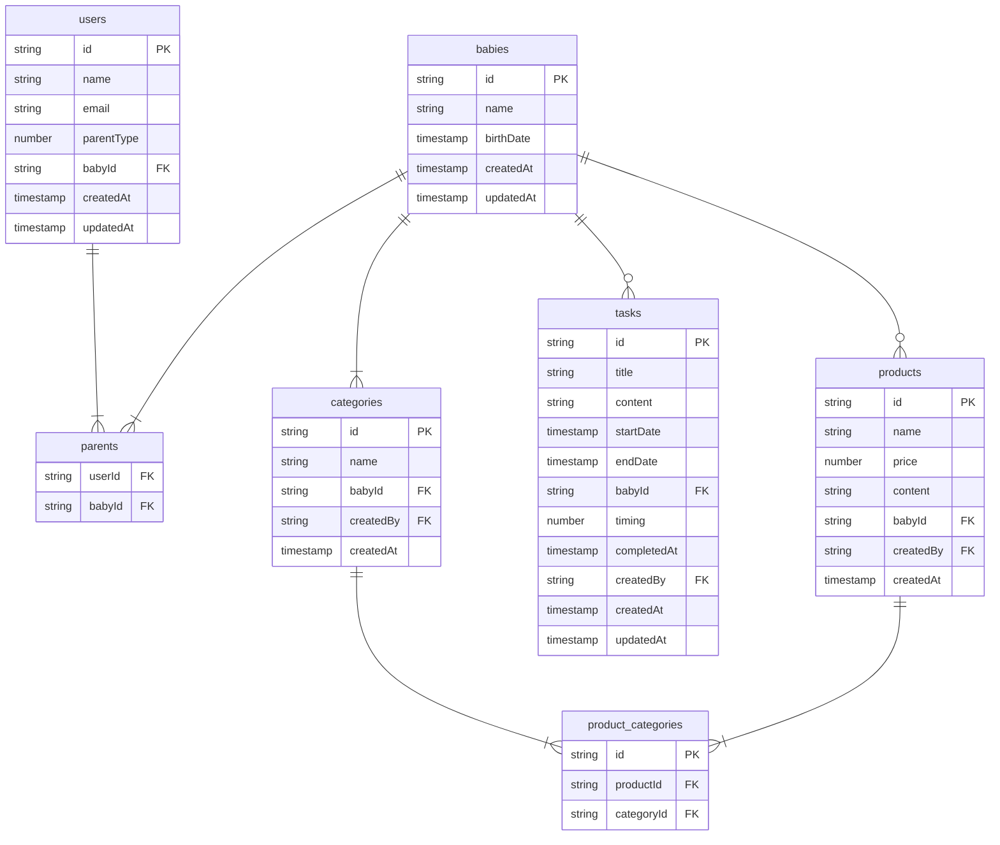

## バージョン

| 技術  | バージョン |
| ----- | ---------- |
| next  | 14.2.23    |
| react | 18         |

## パッケージ

| パッケージ名       | バージョン |
| ------------------ | ---------- |
| firebase/auth      | 1.8.2      |
| firebase/firestore | 4.7.6      |
| boring-avatars     | 1.11.2     |
| firebase           | 11.2.0     |
| react-hook-form    | 7.54.2     |
| react-icons        | 5.4.0      |

## 設計・フォルダ構成

### フォルダ構成

```

├── app/
    │   └── (folder)/
    │       ├── page.tsx
    │       ├── layout.tsx
    │       ├── _components
    │       └── _hooks
    ├── components
    ├── domain/
    │   ├── entities
    │   └── repositories
    ├── constants
    ├── infrastracture/
    │   ├── data
    │   ├── exception/
    │   └── service/
    │       └── firebase/
    │           ├── config/
    │           │   └── firebase_config.ts
    │           ├── exception/
    │           │   └── FirebaseAuthException.ts
    │           ├── auth/
    │           │   └── auth_service.ts
    │           └── firestore/
    │               └── firestore_OO_service.ts
    ├── provider
    └── usecase/
        ├── (add_OO_usecase)/
        ├── (update_OO_usecase)/
        ├── (delete_OO_usecase)/
        └── usecase.ts

```

### 役割

- `app`フォルダ

  - 画面、画面の状態管理、画面の固有のコンポーネントを定義する

- `components`フォルダ

  - ヘッダーやメイン、ナビゲーションなど共通コンポーネントを定義する

- `domain`フォルダ

  - `entities`とそれに対応する`repositories`を定義する。

  - `entities`はアプリ内で使用するエンティティを定義する。

  - `repositories`はそれにエンティティに対応するリポジトリに加え、認証周りや中間テーブルなど例外的なリポジトリもここで定義する。(interface として定義)

- `constants`フォルダ

  - アプリ内で使用する定数を定義する。

- `infrastracture`フォルダ

  - データベースとのやりとりする処理を定義する。

  - `data`フォルダは、データベースのエンティティを定義する。

  - `exception`フォルダは、認証情報がない場合など、外部の影響を受けない例外処理を定義する。

  - `service`フォルダは firebase や supabase といった外部サービスを定義する。

  - `service/firebase/config`フォルダは、`authentication`や`firestore`などサービスの初期化を定義する。

  - `service/firebase/exception`フォルダは、`firebase`に依存した例外処理を定義する。

  - `service/firebase/auth`フォルダは、`firebase authentication`に関する処理を定義する。

  - `service/firebase/firestore`フォルダは、`firebase cloud_firestore`に関する処理を定義する。

  - `auth`と`firestore`の処理は`domain/repositories`のインターフェースを具象化する。

- `provider`フォルダは、認証情報などのアプリ全体で状態管理すべき処理を定義する。

- `usecase`フォルダは、機能ごとに定義し、UI から取得したデータを元に DB に連携する処理を定義する。

## テーブル設計

`cloud_firestore`のため関係は設定できないが、リレーションをもつ想定でテーブル設計をする。

現状は、`babies`をトップに各データを保持しているが、誰がデータを作ったのかという情報も`createdBy`項目として、念の為持たせている


